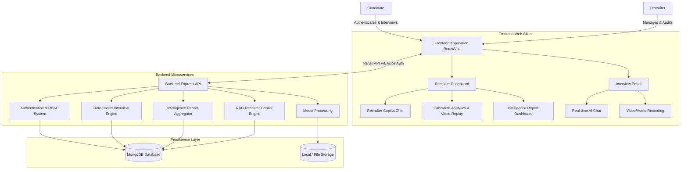

# MockMate AI – Enterprise Interview Verification & Evaluation Platform

MockMate AI is an advanced, production-ready platform designed to conduct, record, and evaluate technical and behavioral interviews. Outfitted with role-based interviewing engines, a RAG-powered Recruiter Copilot, and comprehensive Intelligence Reports, the platform provides recruiters with deep, objective insights while offering candidates a modern, seamless interview experience.

## 🎨 Design Philosophy
MockMate AI features a premium aesthetic leveraging a structured modern design palette—including dark plum and light cream. The interface is meticulously crafted to be fully responsive, accessible, and intuitive—delivering an executive-level experience for recruiters assessing talent and candidates performing high-stakes interviews.

## 🏗 System Architecture & Flow



## ✨ Core Features

### 🏢 Enterprise Recruiter Dashboard
- **Centralized Management**: An executive interface to view candidate pipelines, interview history, and aggregate skill scores across multiple roles.
- **Video Replay Mode**: Persistent storage and playback of recorded candidate interviews to aid panel reviews.

### 🧠 RAG-Powered Recruiter Copilot
- **Data-Driven Insights**: Ask natural language questions about candidate performance based on historical interview transcripts, resumes, and system evaluations.
- **Side-by-Side Comparisons**: Instantly compare candidate strengths, weakness, and role readiness against specific job requirements.

### 📊 Final Interview Intelligence Reports
- **Detailed Aggregation**: Compiles technical depth, behavioral traits, communication skills, and integrity markers into one holistic assessment.
- **Exportable Assets**: Support for offline distribution via automated PDF and JSON exports directly from the dashboard.

### 🎯 Dynamic Role-Based Interview Engine
- **Adaptive Questioning**: Automatically tailors the interview flow, evaluation criteria, and intelligence reports based on candidate resumes and selected roles.
- **Skill Gap Analysis**: Identifies areas of potential growth compared to baseline expectations for specific technical or HR roles.

### 🔐 Secure & Scalable Foundation
- **JWT & RBAC**: Fully authenticated endpoints utilizing JSON Web Tokens with clear delineations between Candidate and Recruiter access boundaries.
- **NoSQL Persistence**: Fully migrated to MongoDB for high-availability document storage and complex analytical queries.

## 🚀 Tech Stack

- **Frontend**: React.js (Vite), Vanilla CSS, Context API / Hooks
- **Backend**: Node.js, Express.js
- **Database**: MongoDB (Mongoose ORM)
- **Security & Auth**: JSON Web Tokens (JWT), Role-Based Access Control (RBAC), bcrypt
- **AI Integration**: Custom Mock Simulation Engine, RAG-based context parsing models
- **Exports**: Comprehensive JSON extraction and PDF generation

## 🛠️ Getting Started

### Prerequisites
- Node.js (v18 or higher recommended)
- MongoDB running locally or a valid MongoDB Atlas URI
- npm or yarn package managers
- **Docker and Docker Compose** (Optional, but recommended for easy setup)

### Docker Setup (Recommended)

The easiest way to run MockMate AI locally is using Docker. This will automatically set up the frontend, backend, and a persistent MongoDB database.

1. **Clone the repository**:
   ```bash
   git clone https://github.com/your-username/MockMateAI.git
   cd MockMateAI
   ```

2. **Set up Environment Variables**:
   Copy the example environment files for both backend and frontend:
   ```bash
   cp backend/.env.example backend/.env
   cp frontend/.env.example frontend/.env
   ```
   *Note: Open `backend/.env` and add your required secrets such as `GEMINI_API_KEY` and `JWT_SECRET`.*

3. **Start the application**:
   ```bash
   docker compose up --build
   ```

The application will now be running:
- Frontend: `http://localhost:5173`
- Backend API: `http://localhost:5000`

---

### Manual Installation (Without Docker)

1. **Clone the repository**:
   ```bash
   git clone https://github.com/your-username/MockMateAI.git
   cd MockMateAI
   ```

2. **Setup Backend**:
   ```bash
   cd backend
   npm install
   ```

3. **Setup Frontend**:
   ```bash
   cd ../frontend
   npm install
   ```

### Configuration
Create a `.env` file in the `backend` directory containing the following environment variables:
```env
PORT=5000
MONGO_URI=mongodb://localhost:27017/mockmateai
JWT_SECRET=your_super_secret_jwt_key
```

### Running the Application

1. **Start the Backend Server**:
   ```bash
   cd backend
   npm run dev
   ```
   *The API will be available on `http://localhost:5000`.*

2. **Start the Frontend Client**:
   ```bash
   cd frontend
   npm run dev
   ```
   *The React application will mount on the specified development port (usually `http://localhost:5173` or `5174`).*

## 🔮 Future Roadmap
- Continuous integration with dynamic LLMs for completely unscripted back-and-forth candidate conversations.
- Voice-to-Text inference to power hands-free candidate interviews.

---
*Created with ❤️ by Antigravity*
